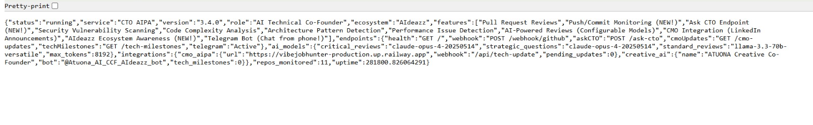
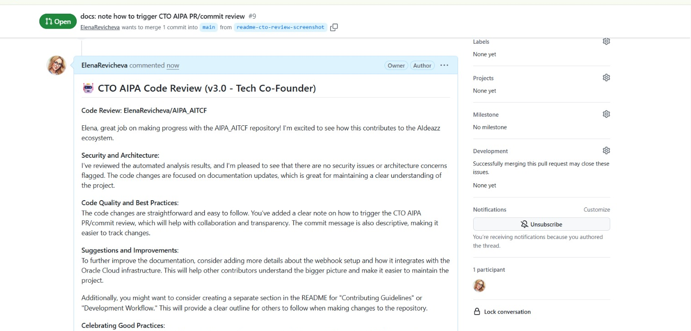
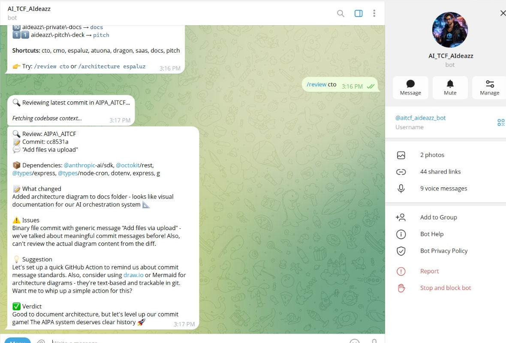
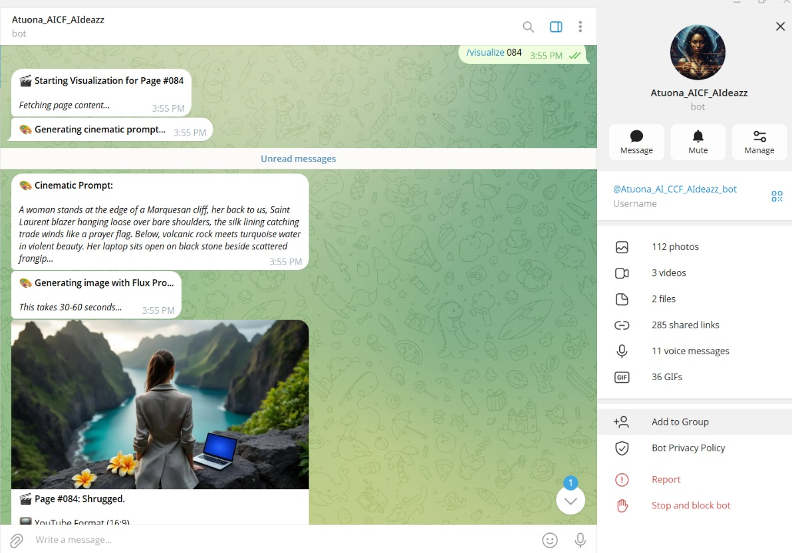
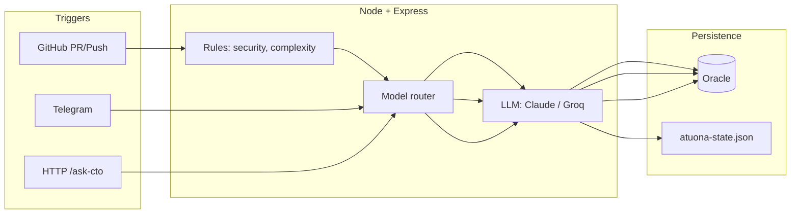

# CTO AIPA — Production AI Code Review & Agent Orchestration System

Single TypeScript service that:

- Automatically reviews every PR and push
- Routes between LLMs based on criticality
- Persists technical memory in Oracle Autonomous DB
- Exposes technical Q&A via API and Telegram

Deployed on Oracle Cloud. PM2-managed. <$1/month operational cost.

[]()
[]()
[]()
[]()
[]()

> **Elena Revicheva** · [AIdeazz](https://aideazz.xyz) · [LinkedIn](https://linkedin.com/in/elenarevicheva)

---

### Screenshots

| [](docs/assets/readme-architecture.png) | [](docs/assets/readme-pr-review.png) |
|:---:|:---:|
| **1. Architecture or health** — System overview or `GET /` response | **2. PR review** — GitHub PR or commit with CTO review comment |
| [](docs/assets/readme-telegram.png) | [](docs/assets/readme-atuona.png) |
| **3. Telegram** — CTO bot menu or `/ask` / `/daily` response | **4. Atuona** — `/create` or `/visualize` output |

*Add images to `docs/assets/` (see [docs/assets/README.md](docs/assets/README.md)).*  
Trigger CTO AIPA review: open a PR or push to main — webhook posts the comment.

---

### Architecture (high level)



- **Triggers:** GitHub webhook, Telegram (Grammy), HTTP `POST /ask-cto`.
- **Service:** Single process. Deterministic rules run first; then model router; then LLM. Results persisted to Oracle (and file for Atuona).
- **Persistence:** Oracle Autonomous DB (mTLS) for CTO memory, tech debt, context; JSON file for Atuona creative state.

---

### Orchestration flow (bullet pipeline)

**Code review (PR or push):**

1. GitHub sends webhook → Express receives.
2. Fetch diff; run **deterministic** checks (security, complexity, architecture patterns).
3. **Route:** If critical (security/payment/keywords) or explicit override → Claude Opus 4; else → Groq Llama 3.3 70B.
4. Build prompt with diff + rule results + last N memories from Oracle.
5. LLM returns review text → post comment on PR/commit.
6. Save to `aipa_memory` (Oracle); notify CMO webhook (non-blocking).

**Ask CTO (API or Telegram):**

1. Request (JSON or message) → load conversation context from Oracle.
2. **Route:** Always Claude Opus 4 for strategic Q&A.
3. LLM returns answer → save to `aipa_memory` and conversation context; respond to client.

**Atuona (Telegram):**

1. Message/voice → Whisper for transcription if voice.
2. Load `atuona-state.json` (mood, creative memory); select mood; inject knowledge + anti-repetition lists.
3. Claude Opus 4 generates → `extractAndTrackFromResponse()` updates creative memory → save state; reply.

---

### Model routing logic

| Trigger / task | Model | Reason |
|----------------|--------|--------|
| Code review, **critical** (security, payment, or `useClaudeForCritical`) | Claude Opus 4 | Best for security and architecture reasoning. |
| Code review, **standard** | Groq Llama 3.3 70B | Fast, free tier; sufficient for routine style/complexity. |
| Ask CTO (API or Telegram) | Claude Opus 4 | Strategic and multi-repo context. |
| Voice message (Telegram) | Whisper (Groq) → then Claude Opus 4 | Transcription then same as text. |
| Atuona (all text/creative) | Claude Opus 4 | Consistency and creative quality. |
| Atuona image/video | Replicate / Runway / Luma / DALL·E | Per-request availability. |

Configurable via env: `CRITICAL_MODEL`, `STRATEGIC_MODEL`, `STANDARD_MODEL`.

---

### Why deterministic + LLM split

- **Deterministic rules** handle everything that must be consistent and cheap: regex/pattern checks for SQL injection, hardcoded secrets, XSS, `eval`, debug code; line-count and nesting for complexity; detection of patterns (async/await, try-catch, types). No token cost, no flakiness, instant. The LLM then gets a structured summary (e.g. “3 high, 2 low”) and the diff, and focuses on synthesis and advice.
- **LLM** is used only where reasoning or language is needed: review narrative, answer to “How should I structure auth?”, dialogue, creative text. We avoid using the model for things that can be computed.
- **Result:** Lower cost (Groq for most reviews), predictable security/complexity signals, and a single place to tune “when to use Claude” (critical path and config).

---

### Data lifecycle (how memory tables are used)

| Store | Written when | Read when |
|-------|----------------|-----------|
| **aipa_memory** | After every code review and every Ask CTO answer. | Before review (last N for this repo/action); before Ask CTO (recent Q&A). |
| **tech_debt** | When user or CTO records tech debt via Telegram/API. | When listing or resolving debt. |
| **arch_decisions** | When a decision is recorded. | When listing decisions for context. |
| **pending_code** | When CTO proposes code (e.g. `/code`, `/fix`) and waits for approval. | When user approves or when loading pending list. |
| **alert_preferences** | When user toggles alerts/daily briefing. | When running cron (briefing, alerts). |
| **conversation_context** | When user sends files/questions; when CTO responds. | At start of each Telegram session (7-day window). |
| **knowledge_base** | When user adds knowledge. | When answering with project/category context. |
| **atuona-state.json** | After every Atuona response: metaphors, paintings, fingerprints, etc. | On every Atuona message: mood, creative memory, anti-repetition lists. |

All Oracle writes are best-effort (errors logged, no throw to client). Reads fall back to empty/default so the app stays up if DB is temporarily unavailable.

---

### Failure handling & monitoring

| Layer | Behavior |
|-------|----------|
| **HTTP/Webhook** | Try/catch per request; 500 with message on uncaught error; CMO webhook failure → update stored in memory for later sync. |
| **Oracle** | Connection errors logged; `getRelevantMemory` / `saveMemory` return empty or no-op on failure so the request can continue (e.g. review without prior context). |
| **LLM APIs** | Anthropic/Groq errors caught and logged; user gets a short “service temporarily unavailable” style message. |
| **Telegram** | Grammy error handler; failed sends logged; no process crash. |
| **Process** | PM2: restart on exit; startup on boot. External cron hits `GET /` every 5 min and restarts service if needed (see Oracle resilience docs). |
| **Logs** | stdout/stderr → `pm2 logs cto-aipa`. No PII in logs; stack traces on errors. |

---

## 🎯 What CTO AIPA does

- 🔍 **Reviews every code change** (PRs AND direct pushes to main)
- 💬 **Answers technical questions** anytime via API or Telegram
- 🧠 **Knows your entire ecosystem** (11 AIdeazz repositories)
- 🔐 **Detects security vulnerabilities** before production
- 📊 **Analyzes architecture** and suggests improvements
- 🤝 **Coordinates with CMO AIPA** for LinkedIn announcements
- ☀️ **Daily briefings** - Start each day informed
- 🔔 **Proactive alerts** - CTO watches your ecosystem 24/7
- 🎤 **Voice messages** - Talk naturally via Telegram
- ⚡ **Runs 24/7** on Oracle Cloud (PM2, health checks, cron)

No code review bottlenecks; strategic technical guidance on demand.

---

## What's in v4.0

- Oracle Cloud deployment (PM2, startup credits)
- Atuona: persistent creative memory, anti-repetition, multi-modal (text + image + video via Replicate/Runway/Luma)
- Repository cleanup: docs in `docs/`, strengthened `.gitignore`

---

## 🚀 How To Use Your CTO

**Quick connect:** See **[docs/CONNECT_TO_CTO_AIPA.md](docs/CONNECT_TO_CTO_AIPA.md)** for all ways to reach your CTO (Telegram, terminal, API, GitHub).

### 📍 Endpoints

| Endpoint | Method | Description |
|----------|--------|-------------|
| `/` | GET | Health check & status |
| `/ask-cto` | POST | Ask any technical question |
| `/webhook/github` | POST | Receives GitHub webhooks |
| `/cmo-updates` | GET | View pending CMO updates |
| `/tech-milestones` | GET | View tech milestones |
| **Telegram Bot** | - | Chat with CTO from your phone! |

### 💬 Ask CTO - Get Technical Advice Anytime

**From any terminal:**
```bash
curl -X POST http://<your-server-ip>:3000/ask-cto \
  -H "Content-Type: application/json" \
  -d '{"question":"Should I use MongoDB or PostgreSQL for my project?"}'
```

**With context:**
```bash
curl -X POST http://<your-server-ip>:3000/ask-cto \
  -H "Content-Type: application/json" \
  -d '{
    "question": "How should I structure the authentication?",
    "repo": "MyProject",
    "context": "Currently using JWT tokens"
  }'
```

### 🔍 Automatic Code Reviews

**For Pull Requests:**
1. Create a PR in any connected repo
2. CTO AIPA automatically reviews within 30 seconds
3. Review comment appears on the PR

**For Direct Pushes:**
1. Push to `main` or `master` branch
2. CTO AIPA reviews the commits
3. Review comment appears on the commit

---

## 🤖 AI Models

CTO AIPA uses the **best AI models** for each task:

| Task | Model | Why |
|------|-------|-----|
| Critical Reviews | Claude Opus 4 | Best for security & architecture |
| Ask CTO Questions | Claude Opus 4 | Best for strategic thinking |
| Standard Reviews | Llama 3.3 70B | Fast & free via Groq |
| Voice Transcription | Whisper (Groq) | Fast & accurate |

### Configuration

Edit `.env` on your server:
```bash
CRITICAL_MODEL=claude-opus-4-20250514
STRATEGIC_MODEL=claude-opus-4-20250514
STANDARD_MODEL=llama-3.3-70b-versatile
MAX_TOKENS=8192
```

*(Orchestration, model routing, and data lifecycle are described in the sections at the top.)*

---

## 🧠 AIdeazz Ecosystem

CTO AIPA knows and monitors **11 repositories**:

| # | Repo | Role |
|---|------|------|
| 1 | **AIPA_AITCF** | CTO AIPA (this repo) |
| 2 | **VibeJobHunterAIPA_AIMCF** | CMO AIPA + Job Hunter |
| 3 | **EspaLuzWhatsApp** | AI Spanish Tutor |
| 4 | **EspaLuz_Influencer** | EspaLuz Marketing |
| 5 | **EspaLuzFamilybot** | Family Bot Version |
| 6 | **aideazz** | Main Website |
| 7 | **dragontrade-agent** | Web3 Trading Assistant |
| 8 | **atuona** | NFT Gallery |
| 9 | **ascent-saas-builder** | SaaS Builder Tool |
| 10 | **aideazz-private-docs** | Private Documentation |
| 11 | **aideazz-pitch-deck** | Investor Pitch Materials |

---

## 📱 Telegram Bot

Chat with your CTO from your phone — now with voice messages!

### Setup

1. Create a bot via [@BotFather](https://t.me/BotFather) on Telegram
2. Add to `.env` on your server:
   ```
   TELEGRAM_BOT_TOKEN=<your-bot-token>
   TELEGRAM_AUTHORIZED_USERS=<your-telegram-user-id>
   ```
3. Restart: `pm2 restart cto-aipa`

### Commands

| Command | Description |
|---------|-------------|
| `/menu` | 📋 Show organized menu of all commands |
| `/learn <topic>` | 🎓 Start a coding lesson |
| `/exercise` | 🏋️ Get a coding challenge |
| `/explain <concept>` | 📚 Explain any coding concept |
| `/code <repo> <task>` | 💻 CTO writes code & creates PR! |
| `/fix <repo> <issue>` | 🔧 CTO fixes bugs & creates PR! |
| `/stats` | 📊 Ecosystem metrics & weekly activity |
| `/daily` | ☀️ Get your morning briefing |
| `/idea <text>` | 💡 Capture startup ideas |
| `/ideas` | 💾 View all saved ideas |
| `/ask <question>` | 💬 Ask any technical question |
| `/review <repo>` | 🔍 Review latest commit |
| `/repos` | 📋 List all repositories |
| `/alerts` | 🔔 Toggle proactive alerts |
| `/status` | 🏥 Service health check |
| `/announce` | 📢 Announce tech milestone |

### 📸 Screenshot Analysis

Send any image and get instant AI analysis:
- **Error screenshots** → Identify bug and suggest fix
- **UI mockups** → UX feedback and improvements
- **Architecture diagrams** → Review and optimization
- **Code snippets** → Quick code review

Just send a photo - no command needed!

### 🎤 Voice Messages

Just hold the mic button and talk naturally:
- "What should I focus on today?"
- "How do I add caching to my project?"
- "Review my architecture decisions"

Your voice is transcribed by Whisper (Groq) and processed by Claude Opus 4.

### ☀️ Daily Briefings

Every day at **8 AM Panama time**, you'll receive:
- Ecosystem health status
- Recent repo activity
- Stale repos that need attention
- AI-generated focus suggestion for the day

Use `/alerts` to toggle on/off.

### 🔔 Proactive Alerts

CTO AIPA monitors your ecosystem and alerts you about:
- ⚠️ Repos with no commits in 5+ days
- 🚨 Services that go offline
- 📊 Important status changes

Alerts run every 4 hours automatically.

---

## Atuona (second agent in same process)

Second Telegram bot in this repo: **persistent creative memory**, **anti-repetition** (response fingerprints, used metaphors/paintings/insights tracked), **multi-modal orchestration** (text via Claude Opus 4; image/video via Replicate, Runway, Luma, DALL·E). State in `atuona-state.json` (local file, not in repo); every response runs through `extractAndTrackFromResponse()` and persists. Commands: `/create`, `/scene`, `/dialogue`, `/visualize`, `/publish`, etc. Set `ATUONA_BOT_TOKEN` in `.env` and restart PM2.

---

## 🤝 CMO Integration

CTO AIPA automatically notifies CMO AIPA when:
- A PR is reviewed
- A push is analyzed
- Technical milestones are reached

**CMO then:**
- Posts about tech updates on LinkedIn
- Schedules announcements at optimal times

---

## 🏗️ Technical Architecture (detailed)

*(Simple diagram and data flow are in the [Architecture](#architecture-high-level) and [Orchestration flow](#orchestration-flow-bullet-pipeline) sections at the top.)*

Single Node/Express process: GitHub webhooks and HTTP API drive the CTO pipeline; Telegram serves both CTO and Atuona via two bots. Oracle holds all persistent state; CMO is notified via webhook for LinkedIn-ready updates.

```
┌─────────────────────────────────────────────────────────────────────────┐
│                           AIdeazz AIPA Suite v4.0                       │
├─────────────────────────────────────────────────────────────────────────┤
│                                                                         │
│   ┌──────────────────────────────────────────────────────────────┐      │
│   │                  🤖 CTO AIPA (Tech Co-Founder)                │      │
│   │   GitHub Webhook ────► Express Server ────► AI Analysis       │      │
│   │        │                    │                   │             │      │
│   │        ▼                    ▼                   ▼             │      │
│   │   [PR or Push]        [Oracle ATP]      [Claude Opus 4]       │      │
│   │        │                    │            [Groq Llama/Whisper] │      │
│   │        ▼                    ▼                   │             │      │
│   │   GitHub Comment      Memory Storage            ▼             │      │
│   │        └──────────────► CMO AIPA ──────► LinkedIn Post        │      │
│   │                                                               │      │
│   │   Telegram Bot                                                │      │
│   │   📸 Photos │ 🎤 Voice │ 💡 Ideas │ 💻 Code │ 🎓 Learn        │      │
│   └──────────────────────────────────────────────────────────────┘      │
│                              │                                          │
│                              ▼                                          │
│   ┌──────────────────────────────────────────────────────────────┐      │
│   │                🎭 ATUONA (Creative Co-Founder)                │      │
│   │                                                               │      │
│   │   Input ──► Emotional Intelligence (13 moods)                 │      │
│   │                    │                                          │      │
│   │                    ▼                                          │      │
│   │         Associative Intelligence (7 domains, 28 insights)    │      │
│   │         + Knowledge Base (11 domains)                        │      │
│   │                    │                                          │      │
│   │                    ▼                                          │      │
│   │         [Claude Opus 4] ──► extractAndTrackFromResponse()    │      │
│   │                    │              │                           │      │
│   │                    ▼              ▼                           │      │
│   │         /publish ──► GitHub   Creative Memory (persistent)   │      │
│   │              │                [atuona-state.json]             │      │
│   │              ▼                                                │      │
│   │         atuona.xyz (Fleek/IPFS)                              │      │
│   │   📝 Create │ 🎨 Scene │ 💬 Dialogue │ ✨ Inspire │ 🎬 Film    │      │
│   └──────────────────────────────────────────────────────────────┘      │
│                                                                         │
└─────────────────────────────────────────────────────────────────────────┘
```

**Stack:**
- **Backend:** TypeScript 5.7, Node.js 20, Express.js
- **AI:** Claude Opus 4 (critical), Groq Llama 3.3 70B (fast), Groq Whisper (voice)
- **Database:** Oracle Autonomous Database 26ai (mTLS encrypted, Always Free)
- **Infrastructure:** Oracle Cloud VM.Standard.E5.Flex, Ubuntu 24.04, PM2
- **Integrations:** GitHub API, CMO AIPA (Railway), Telegram Bot API
- **Scheduling:** node-cron for daily briefings and health checks

---

## 🔒 Security Features

- ✅ Hardcoded credentials detection
- ✅ SQL injection vulnerability scanning
- ✅ XSS vulnerability detection
- ✅ Dangerous function usage (eval)
- ✅ Debug code detection (console.log)
- ✅ Code complexity analysis
- ✅ Architecture pattern recognition
- ✅ mTLS database encryption with wallet

---

## 💰 Cost Analysis

| Component | Service | Monthly Cost |
|-----------|---------|--------------|
| Compute (1 OCPU, 12GB RAM) | Oracle Cloud | $0 (Startup Credits) |
| Database (26ai, Always Free) | Oracle ATP | $0 |
| Storage (50GB) | Oracle Block Storage | $0 |
| AI - Standard Reviews | Groq (free tier) | $0 |
| AI - Critical Reviews | Anthropic Claude | ~$0.50 |
| **Total** | | **< $1/month** |

---

## Roadmap

- [x] v4.0: Code review pipeline, Ask CTO, Oracle persistence, Atuona (persistent creative memory, multi-modal).
- [ ] Next: Multi-repo learning, custom coding standards.

---

## 🔧 Server Management

**Check status:**
```bash
pm2 status
```

**View logs:**
```bash
pm2 logs cto-aipa --lines 50
```

**Restart service:**
```bash
pm2 restart cto-aipa
```

**Update code:**
```bash
cd ~/cto-aipa
git pull origin main
npm run build
pm2 restart cto-aipa
```

---

## 📋 Environment Variables

Create a `.env` file with these variables (do not commit to git!):

```bash
# Oracle Database (mTLS with Wallet)
DB_USER=<your-db-user>
DB_PASSWORD=<your-db-password>
DB_SERVICE_NAME=<your-service-name>
WALLET_PASSWORD=<your-wallet-password>

# AI APIs
GROQ_API_KEY=<your-groq-api-key>
ANTHROPIC_API_KEY=<your-anthropic-api-key>
OPENAI_API_KEY=<your-openai-api-key>

# GitHub
GITHUB_TOKEN=<your-github-token>

# Telegram Bots
TELEGRAM_BOT_TOKEN=<your-cto-bot-token>
TELEGRAM_AUTHORIZED_USERS=<your-telegram-user-id>
ATUONA_BOT_TOKEN=<your-atuona-bot-token>

# Optional: Ask CTO from this repo (npm run ask-cto)
CTO_AIPA_URL=http://YOUR_SERVER_IP:3000
# Optional: URL shown in server startup logs (no hardcoded IPs in code)
CTO_AIPA_PUBLIC_URL=http://YOUR_SERVER_IP:3000

# Optional: AI Image/Video Generation
REPLICATE_API_TOKEN=<your-replicate-token>
RUNWAY_API_KEY=<your-runway-key>
LUMA_API_KEY=<your-luma-key>
```

---

## 📬 Contact

**Elena Revicheva** — Founder, AIdeazz · Open to roles in Applied AI, AI Product, AI Systems, Agent Engineering, AI Solutions.

- 📧 aipa@aideazz.xyz
- 🌐 [aideazz.xyz](https://aideazz.xyz)
- 💼 [LinkedIn](https://linkedin.com/in/elenarevicheva)

---

## 🎉 Highlights (what this repo demonstrates)

| Area | What’s in this repo |
|------|----------------------|
| **LLM orchestration** | Multi-step pipeline (analyze → route → generate → persist); two agent personas (CTO + Atuona); model routing by task criticality. |
| **Integrations** | GitHub API (webhooks, PR comments), Telegram (Grammy, 2 bots), Oracle Autonomous DB (mTLS), Express HTTP, CMO webhook, Replicate/Runway/Luma/OpenAI for image & video. |
| **Persistence & memory** | Oracle tables (reviews, tech debt, arch decisions, lessons, alerts, conversation context, knowledge base); file-based creative state with extraction and anti-repetition. |
| **Production** | Live on Oracle Cloud; PM2, cron, health endpoint; < $1/month; security scanning and structured error handling. |
| **Codebase** | ~15k LOC TypeScript; single deployable service; clear separation between CTO flow, Atuona flow, and shared DB. |

---

**Version 4.0.0 | February 2026 | Production**
