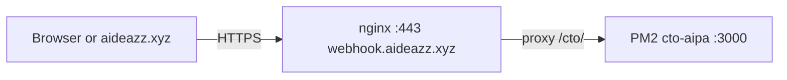

# CTO AIPA on the public internet (HTTPS) — no laptop server

CTO AIPA runs **only on Oracle**. Your PC does not need Node, PM2, or port 3000 open locally.

## What was wrong before

| URL | Meaning |
|-----|--------|
| `http://127.0.0.1:3000/...` | “This computer only” — your **laptop**. Nothing runs there unless you start it. |
| `https://webhook.aideazz.xyz/cto/...` | The **Oracle** machine, reached over the internet through **nginx** (HTTPS). |

## Public API base (production)

After nginx is configured (see repo `scripts/oracle-resilience/nginx-webhook-with-cto-location.conf`):

- **Base URL:** `https://webhook.aideazz.xyz/cto`
- **Health / marketing status:** `GET https://webhook.aideazz.xyz/cto/marketing/inquiry-status`
- **Marketing inquiry from aideazz.xyz (browser, no secret):** `POST https://webhook.aideazz.xyz/cto/marketing/inquiry-proxy` — CORS + Origin/Referer allowlist, honeypot, rate limit.
- **Marketing inquiry (Bearer, for automation):** `POST https://webhook.aideazz.xyz/cto/marketing/inquiry`
- **GitHub webhook (if you point GitHub here):** `POST https://webhook.aideazz.xyz/cto/webhook/github`

The `/cto/` prefix is stripped by nginx; Express still sees paths like `/marketing/inquiry-status`.

## Environment on the server

In `~/cto-aipa/.env`:

```env
CTO_AIPA_PUBLIC_URL=https://webhook.aideazz.xyz/cto
```

Then: `pm2 restart cto-aipa --update-env`

## How it works (one picture)



## Installing or fixing nginx on Oracle

1. Copy the reference config into place (backup the old file first), or merge only the `location /cto/` block into `/etc/nginx/sites-available/webhook`.
2. `sudo nginx -t && sudo systemctl reload nginx`
3. Test: `curl -sS https://webhook.aideazz.xyz/cto/marketing/inquiry-status`

## aideazz.xyz contact form

The **browser must not** hold `MARKETING_INQUIRY_SECRET`. Use a **server-side** or **edge** function (e.g. your static host’s serverless) that adds `Authorization: Bearer <secret>` and `POST`s to:

`https://webhook.aideazz.xyz/cto/marketing/inquiry`

CORS on CTO AIPA already allows origins `https://aideazz.xyz` and `https://www.aideazz.xyz`.
