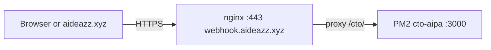

# CTO AIPA on the public internet (HTTPS) — no laptop server

CTO AIPA runs **only on Oracle**. Your PC does not need Node, PM2, or port 3000 open locally.

## What was wrong before

| URL | Meaning |
|-----|--------|
| `http://127.0.0.1:3000/...` | “This computer only” — your **laptop**. Nothing runs there unless you start it. |
| `https://webhook.aideazz.xyz/cto/...` | The **Oracle** machine, reached over the internet through **nginx** (HTTPS). |

## Public API base (production)

After nginx is configured (see repo `scripts/oracle-resilience/nginx-webhook-with-cto-location.conf`):

- **Base URL:** `https://webhook.aideazz.xyz/cto`
- **Health / marketing status:** `GET https://webhook.aideazz.xyz/cto/marketing/inquiry-status`
- **Marketing inquiry from aideazz.xyz (browser, no secret):** `POST https://webhook.aideazz.xyz/cto/marketing/inquiry-proxy` — CORS + Origin/Referer allowlist, honeypot, rate limit.
- **Marketing inquiry (Bearer, for automation):** `POST https://webhook.aideazz.xyz/cto/marketing/inquiry`
- **GitHub webhook (if you point GitHub here):** `POST https://webhook.aideazz.xyz/cto/webhook/github`

The `/cto/` prefix is stripped by nginx; Express still sees paths like `/marketing/inquiry-status`.

## Environment on the server

In `~/cto-aipa/.env`:

```env
CTO_AIPA_PUBLIC_URL=https://webhook.aideazz.xyz/cto
```

Then: `pm2 restart cto-aipa --update-env`

### Deploy code updates on Oracle

SSH: `ssh -i ~/.ssh/ssh-key-2026-01-07private.key ubuntu@170.9.242.90`

```bash
cd ~/cto-aipa
git pull
npm ci
npm run build
pm2 restart cto-aipa --update-env
```

Use `npm ci` (not `npm ci --omit=dev`) so `typescript` / `tsc` is available for the build.

### Inquiry emails (Resend)

Each successful form submission triggers **two** emails (via Resend), when your sender/domain allows it:

1. **Team** — `MARKETING_INQUIRY_NOTIFY_TO` (default `aipa@aideazz.xyz`).
2. **Client confirmation** — the address they typed in the form (unless `MARKETING_INQUIRY_SEND_CONFIRMATION=false`).

With Resend’s **test** sender (`onboarding@resend.dev`), delivery to arbitrary addresses is blocked until you **verify `aideazz.xyz`** at [resend.com/domains](https://resend.com/domains) and set `MARKETING_INQUIRY_FROM` to an address on that domain (e.g. `AIdeazz <noreply@aideazz.xyz>`). Then both team and client notifications work.

`GET …/marketing/inquiry-status` shows `emailNotifyConfigured: true` when `RESEND_API_KEY` (or `RESEND_KEY`) is set in `.env`.

From Windows, after setting the key in your shell (never commit it):

```powershell
$env:RESEND_API_KEY = "re_..."
# Optional verified sender in Resend:
# $env:MARKETING_INQUIRY_FROM = "AIdeazz <noreply@aideazz.xyz>"
.\scripts\oracle-resilience\set_resend_on_oracle.ps1
```

### reCAPTCHA v3 (invisible)

1. Create a **v3** key for `aideazz.xyz` in [Google reCAPTCHA admin](https://www.google.com/recaptcha/admin).
2. **aideazz** build: set **`VITE_RECAPTCHA_SITE_KEY`** (public site key).
3. **Oracle** `~/cto-aipa/.env`: set **`RECAPTCHA_SECRET_KEY`**, then `pm2 restart cto-aipa --update-env`.

Ship the site key in the frontend **before** turning on the secret on the server, or submissions return `captcha_required`. See Phase 3c in `docs/oracle/AIDEAZZ_AI_MARKETING_ENGINE_FULL_ROADMAP.md`.

## How it works (one picture)



## Installing or fixing nginx on Oracle

1. Copy the reference config into place (backup the old file first), or merge only the `location /cto/` block into `/etc/nginx/sites-available/webhook`.
2. `sudo nginx -t && sudo systemctl reload nginx`
3. Test: `curl -sS https://webhook.aideazz.xyz/cto/marketing/inquiry-status`

## aideazz.xyz contact form

The **browser must not** hold `MARKETING_INQUIRY_SECRET`. Use a **server-side** or **edge** function (e.g. your static host’s serverless) that adds `Authorization: Bearer <secret>` and `POST`s to:

`https://webhook.aideazz.xyz/cto/marketing/inquiry`

CORS on CTO AIPA already allows origins `https://aideazz.xyz` and `https://www.aideazz.xyz`.
